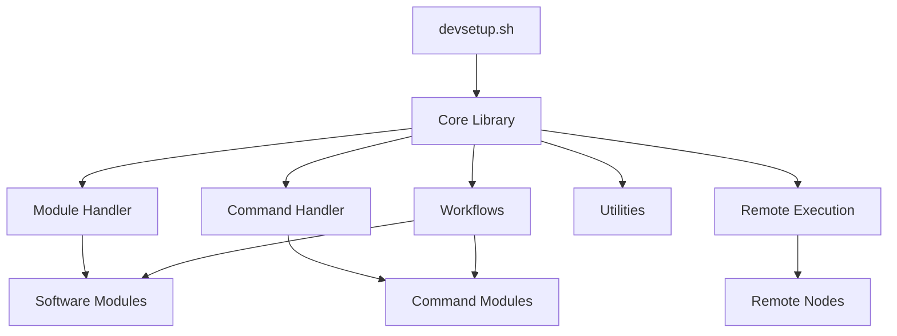

# Modular Development Environment Setup System - Design Plan

## Overview

This document outlines the design and implementation plan for a modular development environment setup system. The system is designed to be flexible, extensible, and capable of setting up development environments across multiple machines with different configurations.

## Goals

1. Create a modular system where each software package is defined in its own configuration file
2. Support custom workflows for different development scenarios
3. Enable remote execution for setting up multiple machines
4. Provide a command system for executing custom operations
5. Support dry run mode for previewing changes without making actual modifications
6. Make the system easily extensible with new modules and commands

## Architecture



## Directory Structure

```
.
├── devsetup.sh                 # Main script
├── .dev/                       # Development setup files
│   ├── lib/                    # Library files
│   │   ├── core.sh             # Core functions
│   │   ├── module.sh           # Module handling functions
│   │   ├── command.sh          # Command handling functions
│   │   ├── remote.sh           # Remote execution functions
│   │   └── utils.sh            # Utility functions
│   ├── config/                 # Configuration files
│   │   ├── vscode_extensions.txt  # VSCode extensions list
│   │   └── remote-nodes.json   # Remote nodes configuration
│   ├── modules/                # Module definitions
│   │   ├── software/           # Software modules
│   │   │   ├── vscode.json     # VSCode module
│   │   │   ├── nodejs.json     # Node.js module
│   │   │   └── ...             # Other software modules
│   │   └── commands/           # Command modules
│   │       └── system-cleanup.json # System cleanup commands
│   └── workflows/              # Workflow definitions
│       ├── default/            # Default workflow
│       │   ├── 00-prepare.json # Preparation steps
│       │   ├── 01-software.json # Software installation
│       │   └── 02-cleanup.json # Cleanup steps
│       ├── development/        # Full development environment workflow
│       │   ├── 00-prepare.json # Preparation steps
│       │   ├── 01-software.json # Software installation
│       │   └── 02-cleanup.json # Cleanup steps
│       ├── web-dev/            # Web development workflow
│       │   ├── 00-prepare.json # Preparation steps
│       │   ├── 01-software.json # Software installation
│       │   └── 02-cleanup.json # Cleanup steps
│       └── mobile-dev/         # Mobile development workflow
│           ├── 00-prepare.json # Preparation steps
│           ├── 01-software.json # Software installation
│           └── 02-cleanup.json # Cleanup steps
```

### Components

1. **Main Script (devsetup.sh)**
   - Entry point for the system
   - Parses command line arguments
   - Initializes the system
   - Executes the requested action

2. **Core Library (core.sh)**
   - Defines core functions and variables
   - Handles logging
   - Provides utility functions used by other components

3. **Module Handler (module.sh)**
   - Loads and validates software modules
   - Installs and uninstalls software
   - Manages dependencies between modules

4. **Command Handler (command.sh)**
   - Processes and executes commands
   - Supports command chaining and references
   - Handles command parameters

5. **Remote Execution (remote.sh)**
   - Manages remote node configurations
   - Deploys the system to remote nodes
   - Executes commands on remote nodes
   - Supports parallel execution

6. **Utilities (utils.sh)**
   - Provides utility functions
   - Handles argument parsing
   - Manages VSCode extensions
   - Creates sample configurations

7. **Software Modules**
   - JSON files defining software packages
   - Include installation and uninstallation commands
   - Define version checking and dependencies
   - Support custom commands

8. **Command Modules**
   - JSON files defining reusable commands
   - Support command chaining and references
   - Can have requirements and parameters

9. **Workflows**
   - Define sequences of operations
   - Combine software installations and commands
   - Support custom pre and post actions

10. **Remote Nodes Configuration**
    - Defines remote machines
    - Includes connection details
    - Supports node grouping

## Module Definition Format

### Software Module

```json
{
  "type": "software",
  "id": "example",
  "name": "Example Software",
  "description": "Description of the software",
  "check_command": "command to check if installed",
  "version_regex": "regex to extract version",
  "install_commands": [
    "command 1",
    "command 2"
  ],
  "uninstall_commands": [
    "command 1",
    "command 2"
  ],
  "dependencies": [
    "dependency1",
    "dependency2"
  ],
  "path_exports": [
    "export PATH=$PATH:/path/to/bin"
  ],
  "commands": {
    "command1": {
      "description": "Description of command1",
      "execute": [
        "command 1",
        "command 2"
      ]
    }
  }
}
```

### Command Module

```json
{
  "type": "command",
  "id": "example-commands",
  "name": "Example Commands",
  "description": "Description of the command module",
  "commands": {
    "command1": {
      "description": "Description of command1",
      "execute": [
        "command 1",
        "command 2"
      ],
      "requires": [
        "requirement1",
        "requirement2"
      ]
    },
    "command2": {
      "description": "Description of command2",
      "execute": [
        "@command1",
        "command 3"
      ]
    }
  }
}
```

### Workflow

```json
{
  "type": "workflow",
  "id": "example-workflow",
  "name": "Example Workflow",
  "description": "Description of the workflow",
  "modules": [
    "module1",
    "module2"
  ],
  "commands": {
    "pre-install": {
      "description": "Pre-installation setup",
      "execute": [
        "command 1",
        "command 2"
      ]
    },
    "post-install": {
      "description": "Post-installation setup",
      "execute": [
        "command 1",
        "command 2"
      ]
    }
  },
  "sequence": [
    "@pre-install",
    "module1:install",
    "module2:install",
    "@post-install"
  ]
}
```

## Implementation Plan

1. **Phase 1: Core Framework**
   - Implement core library functions
   - Create module handling system
   - Implement command processing
   - Set up basic CLI interface

2. **Phase 2: Module System**
   - Define module format
   - Implement module loading and validation
   - Create software installation and uninstallation logic
   - Add dependency management

3. **Phase 3: Workflow System**
   - Define workflow format
   - Implement workflow processing
   - Add support for sequence execution
   - Create default workflow

4. **Phase 4: Remote Execution**
   - Define remote node configuration format
   - Implement remote deployment
   - Add remote command execution
   - Support parallel execution

5. **Phase 5: Extensions and Utilities**
   - Add VSCode extensions support
   - Create utility functions
   - Implement sample generators
   - Add conversion tools for existing configurations

## Usage Examples

### Basic Usage

```bash
# Install all software using the default workflow
./devsetup.sh --install

# Install specific software
./devsetup.sh --install vscode nodejs

# Uninstall software
./devsetup.sh --uninstall vscode

# Use a specific workflow
./devsetup.sh --install --workflow developer

# Dry run (no changes)
./devsetup.sh --install --dry-run

# Verbose output
./devsetup.sh --install --verbose
```

### Remote Execution

```bash
# Deploy and install on a remote node
./devsetup.sh --install --remote dev-laptop

# Execute a command on a remote node
./devsetup.sh --command "apt update && apt upgrade -y" --remote team-server

# Execute in parallel on a node group
./devsetup.sh --install --remote servers --parallel
```

### Command Execution

```bash
# Execute a command
./devsetup.sh --command "system-cleanup:full-cleanup"

# Execute a command with parameters
./devsetup.sh --command "vscode:update"
```

## Future Enhancements

1. **Web Interface**
   - Create a web-based management interface
   - Visualize node status and installed software
   - Provide a dashboard for monitoring

2. **Package Repository**
   - Create a central repository for modules
   - Allow downloading and sharing modules
   - Implement versioning for modules

3. **Integration with CI/CD**
   - Add support for CI/CD pipelines
   - Automate environment setup in CI/CD workflows
   - Provide status reporting

4. **Containerization Support**
   - Add support for Docker and Kubernetes
   - Create container-based development environments
   - Support hybrid deployments

5. **Monitoring and Reporting**
   - Add monitoring for installed software
   - Generate reports on environment status
   - Provide alerts for outdated software

## Specialized Workflows

The system includes several specialized workflows for different development scenarios:

### Full Development Environment

This workflow installs all development tools including:
- VSCode and extensions
- Git tools (GitKraken)
- Web browsers (Chrome, Edge)
- Programming languages (Node.js, Java, Go, .NET)
- Mobile development (Flutter, Android SDK, Android Studio)

### Web Development Environment

This workflow installs tools focused on web development:
- VSCode and extensions
- Git tools (GitKraken)
- Web browsers (Chrome, Edge)
- Node.js and npm
- Web development tools (Angular, React, Vue, etc.)
- MongoDB

### Mobile Development Environment

This workflow installs tools focused on mobile development:
- VSCode and extensions
- Git tools (GitKraken)
- Chrome browser
- Java Development Kit
- Node.js
- Flutter SDK
- Android SDK
- Android Studio
- Mobile development tools (React Native, Ionic, etc.)

## Implementation Status

- [x] Core Framework
- [x] Module System
- [x] Workflow System
- [x] Remote Execution
- [x] Extensions and Utilities
- [x] Specialized Workflows
  - [x] Full Development Environment
  - [x] Web Development Environment
  - [x] Mobile Development Environment