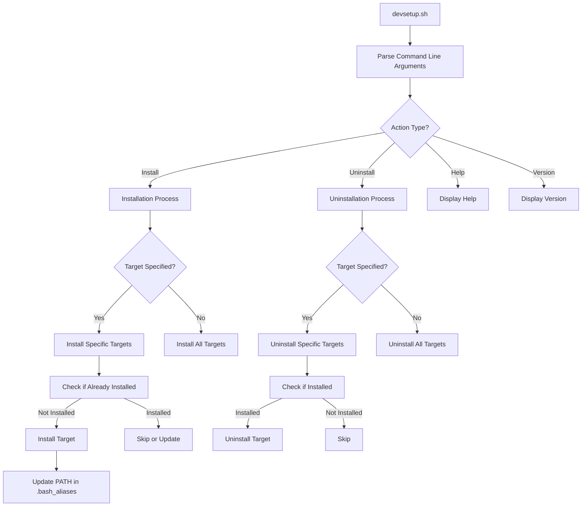

# Development Workstation Setup Script Plan

This document outlines the plan for a shell script that can install and uninstall development tools on Ubuntu 24.04. The script is designed to be safe, predictable, and non-destructive.

## Script Overview

The script will be named `devsetup.sh` and will provide functionality to:

1. Install or uninstall specific software targets or all targets at once
2. Install SDKs to a designated path (default: `/opt/sdks/`)
3. Export SDK path information to the user's `.bash_aliases` file
4. Check if software is already installed and its version
5. Handle dependencies automatically

## Script Structure



## Configuration Files

The script will use two configuration files:

1. `config.json` - Main configuration file with installation details for each target
2. `vscode_extensions.txt` - List of VSCode extensions to install

### Example `config.json` Structure

```json
{
  "vscode": {
    "name": "Visual Studio Code",
    "check_command": "code --version",
    "version_regex": "^([0-9]+\\.[0-9]+\\.[0-9]+)",
    "install_commands": [
      "wget -qO- https://packages.microsoft.com/keys/microsoft.asc | gpg --dearmor > packages.microsoft.gpg",
      "sudo install -D -o root -g root -m 644 packages.microsoft.gpg /etc/apt/keyrings/packages.microsoft.gpg",
      "sudo sh -c 'echo \"deb [arch=amd64,arm64,armhf signed-by=/etc/apt/keyrings/packages.microsoft.gpg] https://packages.microsoft.com/repos/code stable main\" > /etc/apt/sources.list.d/vscode.list'",
      "rm -f packages.microsoft.gpg",
      "sudo apt update",
      "sudo apt install -y code"
    ],
    "uninstall_commands": [
      "sudo apt purge -y code",
      "sudo rm -f /etc/apt/sources.list.d/vscode.list",
      "sudo rm -f /etc/apt/keyrings/packages.microsoft.gpg",
      "sudo apt update"
    ],
    "dependencies": [
      "wget",
      "gpg",
      "apt-transport-https"
    ]
  },
  "flutter": {
    "name": "Flutter SDK",
    "check_command": "flutter --version",
    "version_regex": "Flutter ([0-9]+\\.[0-9]+\\.[0-9]+)",
    "install_commands": [
      "mkdir -p {INSTALL_PATH}/flutter",
      "wget -O flutter.tar.xz https://storage.googleapis.com/flutter_infra_release/releases/stable/linux/flutter_linux_3.19.3-stable.tar.xz",
      "tar xf flutter.tar.xz -C {INSTALL_PATH}",
      "rm flutter.tar.xz",
      "{INSTALL_PATH}/flutter/bin/flutter precache"
    ],
    "uninstall_commands": [
      "rm -rf {INSTALL_PATH}/flutter"
    ],
    "path_exports": [
      "export PATH=\"{INSTALL_PATH}/flutter/bin:$PATH\""
    ],
    "dependencies": [
      "wget",
      "git",
      "unzip",
      "xz-utils",
      "curl"
    ]
  }
}
```

### Example `vscode_extensions.txt`

```
ms-vscode.cpptools
ms-dotnettools.csharp
golang.go
redhat.java
Dart-Code.dart-code
Dart-Code.flutter
```

## Key Functions

The script will include the following key functions:

1. `parse_arguments()` - Parse command line arguments
2. `check_dependencies()` - Check and install required dependencies
3. `check_installed()` - Check if a target is already installed
4. `install_target()` - Install a specific target
5. `uninstall_target()` - Uninstall a specific target
6. `update_bash_aliases()` - Update the user's .bash_aliases file with PATH exports
7. `install_vscode_extensions()` - Install VSCode extensions from the configuration file
8. `display_help()` - Display help information
9. `log_message()` - Log messages with different severity levels

## Command Line Interface

The script will support the following command line options:

```
Usage: ./devsetup.sh [OPTIONS] [TARGETS...]

Options:
  --install, -i       Install specified targets or all if none specified
  --uninstall, -u     Uninstall specified targets or all if none specified
  --path PATH         Specify custom installation path for SDKs (default: /opt/sdks)
  --help, -h          Display this help message
  --version, -v       Display script version

Targets:
  vscode              Visual Studio Code
  vscode-extensions   VSCode Extensions (requires VSCode)
  gitkraken           GitKraken
  chrome              Google Chrome
  edge                Microsoft Edge
  flutter             Flutter SDK
  android-sdk         Android SDK
  android-studio      Android Studio
  dotnet              .NET SDK
  go                  Go Programming Language
  jdk                 Java Development Kit
  nodejs              Node.js

Examples:
  ./devsetup.sh --install                     # Install all targets
  ./devsetup.sh --install vscode flutter      # Install only VSCode and Flutter
  ./devsetup.sh --uninstall nodejs            # Uninstall Node.js
  ./devsetup.sh --install --path ~/sdks go    # Install Go to ~/sdks
```

## Safety Measures

The script will include several safety measures:

1. Check for root privileges when needed and use sudo appropriately
2. Create backups of modified files (e.g., .bash_aliases)
3. Verify checksums of downloaded packages when possible
4. Use version checks to avoid reinstalling already installed software
5. Implement proper error handling and logging
6. Provide a dry-run option to show what would be done without making changes

## Implementation Details

### Installation Process

For each target:
1. Check if already installed
2. If not installed or update requested:
   - Install dependencies
   - Download and install the software
   - Configure paths if needed
   - Verify installation

### Uninstallation Process

For each target:
1. Check if installed
2. If installed:
   - Remove software
   - Clean up configuration files
   - Remove path entries from .bash_aliases

### SDK Path Management

1. Install SDKs to the specified path (default: `/opt/sdks/`)
2. Add appropriate PATH exports to .bash_aliases
3. Ensure proper permissions for the installation directory

### Version Checking

1. Use regex patterns to extract version information
2. Compare installed version with latest available version
3. Provide option to update if a newer version is available

## Testing Strategy

The script will be tested in the following scenarios:

1. Fresh installation on a clean Ubuntu 24.04 system
2. Installation with some software already present
3. Uninstallation of specific targets
4. Installation with custom paths
5. Error handling (network issues, permission problems, etc.)

## Logging and Reporting

The script will provide:

1. Detailed logs of all operations
2. Summary of installed/uninstalled software
3. Clear error messages with suggestions for resolution
4. Version information for installed software

## Implementation Plan

The implementation will be done in the following steps:

1. Create the main shell script (`devsetup.sh`)
2. Create the configuration files (`config.json` and `vscode_extensions.txt`)
3. Implement the core functions for argument parsing and logging
4. Implement the installation and uninstallation functions for each target
5. Add error handling and safety measures
6. Test the script in various scenarios
7. Document the script usage and maintenance