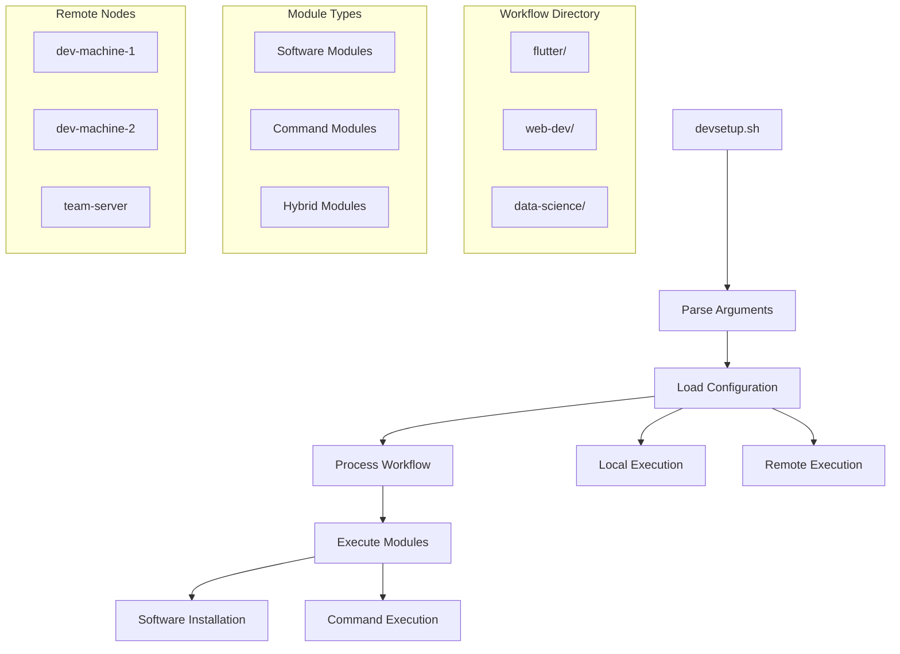

# Modular Development Environment Setup System

## Overview

This document outlines a plan to transform the current monolithic development setup script into a flexible, modular system that supports:

1. **Modular Configuration**: Break up the monolithic config into individual module files
2. **Command Processing**: Define and execute commands within modules or as standalone entities
3. **Remote Execution**: Deploy configurations to multiple machines via SSH
4. **Workflow Management**: Support multiple workflow configurations for different types of workstations



## Directory Structure

The system uses a hybrid approach with a visible script in the project root and a hidden directory for all configuration:

```
project-root/
├── devsetup.sh                  # Main script (visible in project root)
└── .dev/                        # Hidden directory for all configuration
    ├── lib/                     # Script libraries
    │   ├── core.sh              # Core functions
    │   ├── module.sh            # Module handling
    │   ├── command.sh           # Command processing
    │   ├── remote.sh            # Remote execution
    │   └── utils.sh             # Utility functions
    ├── config/                  # Configuration files
    │   ├── settings.json        # Global settings
    │   ├── remote-nodes.json    # Remote node definitions
    │   └── vscode_extensions.txt # VSCode extensions list
    └── workflows/               # Workflow configurations
        ├── default/             # Default workflow
        │   ├── 00-prepare.json
        │   ├── 01-vscode.json
        │   └── 02-cleanup.json
        ├── flutter-dev/         # Flutter development workflow
        │   ├── 00-prepare.json
        │   ├── 01-vscode.json
        │   ├── 02-flutter-sdk.json
        │   └── 03-android-tools.json
        ├── web-dev/             # Web development workflow
        │   ├── 00-prepare.json
        │   ├── 01-vscode.json
        │   ├── 02-nodejs.json
        │   └── 03-browsers.json
        └── modules/             # Shared modules across workflows
            ├── software/        # Software installation modules
            │   ├── vscode.json
            │   ├── flutter.json
            │   ├── nodejs.json
            │   └── ...
            └── commands/        # Standalone command modules
                ├── backup.json
                ├── cleanup.json
                └── ...
```

## Project Portability

This directory structure is designed to be highly portable and project-specific:

1. **Minimal Footprint**: Only one visible script file in the project root
2. **Self-Contained**: All configuration and modules are contained in the hidden `.dev/` directory
3. **Project-Specific**: Each project can have its own customized setup
4. **Version Control Friendly**: Can be committed alongside project code
5. **Easy Distribution**: Can be included in project templates or added to existing projects

This approach enables a true "workstation as code" model where development environment setup can be:
- Shipped directly with source code
- Customized for each project's specific needs
- Consistently applied across team members
- Versioned alongside the project

## Module Formats

### Software Module Format

```json
{
  "type": "software",
  "id": "vscode",
  "name": "Visual Studio Code",
  "description": "Code editor for developers",
  "check_command": "code --version",
  "version_regex": "^([0-9]+\\.[0-9]+\\.[0-9]+)",
  "install_commands": [
    "wget -qO- https://packages.microsoft.com/keys/microsoft.asc | gpg --dearmor > packages.microsoft.gpg",
    "sudo install -D -o root -g root -m 644 packages.microsoft.gpg /etc/apt/keyrings/packages.microsoft.gpg",
    "sudo sh -c 'echo \"deb [arch=amd64,arm64,armhf signed-by=/etc/apt/keyrings/packages.microsoft.gpg] https://packages.microsoft.com/repos/code stable main\" > /etc/apt/sources.list.d/vscode.list'",
    "rm -f packages.microsoft.gpg",
    "sudo apt update",
    "sudo apt install -y code"
  ],
  "uninstall_commands": [
    "sudo apt purge -y code",
    "sudo rm -f /etc/apt/sources.list.d/vscode.list",
    "sudo rm -f /etc/apt/keyrings/packages.microsoft.gpg",
    "sudo apt update"
  ],
  "dependencies": [
    "wget",
    "gpg",
    "apt-transport-https"
  ],
  "path_exports": [],
  "commands": {
    "update": {
      "description": "Update VSCode to the latest version",
      "execute": [
        "sudo apt update",
        "sudo apt install --only-upgrade code"
      ]
    },
    "reset-config": {
      "description": "Reset VSCode configuration",
      "execute": [
        "rm -rf ~/.config/Code/User/settings.json",
        "cp {TEMPLATE_DIR}/vscode/settings.json ~/.config/Code/User/"
      ]
    }
  }
}
```

### Command Module Format

```json
{
  "type": "command",
  "id": "system-cleanup",
  "name": "System Cleanup",
  "description": "Clean up system by removing unused packages and cache",
  "commands": {
    "clean-apt": {
      "description": "Clean APT cache",
      "execute": [
        "sudo apt autoremove -y",
        "sudo apt clean"
      ]
    },
    "clean-docker": {
      "description": "Clean Docker images and containers",
      "execute": [
        "docker system prune -f"
      ],
      "requires": ["docker"]
    },
    "full-cleanup": {
      "description": "Perform a full system cleanup",
      "execute": [
        "@clean-apt",
        "@clean-docker"
      ]
    }
  }
}
```

### Workflow Module Format

```json
{
  "type": "workflow",
  "id": "flutter-setup",
  "name": "Flutter Development Setup",
  "description": "Set up a Flutter development environment",
  "modules": [
    "vscode",
    "flutter",
    "android-sdk",
    "android-studio",
    "chrome"
  ],
  "commands": {
    "prepare": {
      "description": "Prepare the system for Flutter development",
      "execute": [
        "sudo apt update",
        "sudo apt upgrade -y",
        "@system-cleanup:clean-apt"
      ]
    },
    "post-install": {
      "description": "Post-installation configuration",
      "execute": [
        "flutter doctor",
        "flutter config --android-sdk {INSTALL_PATH}/android-sdk"
      ]
    }
  },
  "sequence": [
    "@prepare",
    "vscode:install",
    "flutter:install",
    "android-sdk:install",
    "android-studio:install",
    "chrome:install",
    "@post-install"
  ]
}
```

### Remote Nodes Configuration

```json
{
  "nodes": [
    {
      "id": "dev-laptop",
      "name": "Development Laptop",
      "host": "192.168.1.100",
      "user": "developer",
      "key_file": "~/.ssh/dev_laptop",
      "install_path": "/opt/sdks"
    },
    {
      "id": "team-server",
      "name": "Team Development Server",
      "host": "dev-server.example.com",
      "user": "admin",
      "key_file": "~/.ssh/team_server",
      "install_path": "/opt/development"
    }
  ],
  "groups": {
    "development": ["dev-laptop"],
    "servers": ["team-server"],
    "all": ["dev-laptop", "team-server"]
  }
}
```

## Implementation Plan

### Phase 1: Core Refactoring

1. **Refactor Script Structure**
   - Split the monolithic script into modular components
   - Create a library structure for core functions
   - Implement module loading and validation

2. **Implement Module Composition**
   - Create functions to load modules from directories
   - Implement module composition based on file order (00-, 01-, etc.)
   - Support referencing shared modules

3. **Update Command Line Interface**
   - Add workflow selection option
   - Add remote execution options
   - Maintain backward compatibility

### Phase 2: Command Processing

1. **Command Definition**
   - Implement command parsing from module files
   - Support both inline and referenced commands
   - Handle command dependencies and sequences

2. **Command Execution**
   - Execute single commands
   - Execute command sequences
   - Support referencing commands from other modules

3. **Command Utilities**
   - Implement variable substitution in commands
   - Add conditional execution based on environment or previous results
   - Support error handling and recovery

### Phase 3: Remote Execution

1. **Remote Configuration**
   - Implement remote node configuration loading
   - Add node validation and connection testing
   - Support node grouping for batch operations

2. **SSH Execution**
   - Implement secure file transfer for scripts and modules
   - Support remote command execution
   - Handle SSH authentication and key management

3. **Parallel Execution**
   - Implement parallel execution across multiple nodes
   - Add progress tracking and reporting
   - Support synchronization between nodes when needed

### Phase 4: Workflow Management

1. **Workflow Organization**
   - Implement workflow directory structure
   - Support workflow inheritance and composition
   - Add workflow validation

2. **Workflow Execution**
   - Execute workflows in the defined sequence
   - Support conditional execution within workflows
   - Implement workflow status tracking

3. **Workflow Templates**
   - Create template workflows for common setups
   - Support customization of templates
   - Implement workflow generation tools

## Key Functions Implementation

### Enhanced Command Line Interface

```
Usage: ./devsetup.sh [OPTIONS] [TARGETS...]

Options:
  --workflow, -w WORKFLOW   Specify workflow to use (default: default)
  --install, -i             Install specified targets or all if none specified
  --uninstall, -u           Uninstall specified targets or all if none specified
  --command, -c COMMAND     Execute a specific command
  --remote, -r NODE         Execute on remote node(s)
  --parallel, -p            Execute on multiple remote nodes in parallel
  --path PATH               Specify custom installation path for SDKs (default: /opt/sdks)
  --dry-run                 Show what would be done without making changes
  --verbose, -v             Display verbose output
  --help, -h                Display this help message
  --version                 Display script version

Examples:
  ./devsetup.sh --workflow flutter-dev --install
  ./devsetup.sh --command system-cleanup:full-cleanup
  ./devsetup.sh --remote dev-laptop --workflow web-dev --install
  ./devsetup.sh --remote all --parallel --command update-system
```

### Module Loading Function

```bash
# Function to load modules from a workflow directory
load_workflow_modules() {
  local workflow_dir="$1"
  local modules=()
  
  # Check if workflow directory exists
  if [ ! -d "$workflow_dir" ]; then
    log_message "ERROR" "Workflow directory not found: $workflow_dir"
    exit 1
  }
  
  # Get list of module files in order
  for module_file in $(ls -v "$workflow_dir"/*.json 2>/dev/null); do
    if [ -f "$module_file" ]; then
      # Validate module
      if validate_module "$module_file"; then
        modules+=("$module_file")
      else
        log_message "WARNING" "Skipping invalid module: $module_file"
      fi
    fi
  done
  
  log_message "INFO" "Loaded ${#modules[@]} modules from workflow: $(basename "$workflow_dir")"
  return modules
}

# Function to validate a module
validate_module() {
  local module_file="$1"
  local required_fields=()
  local module_type
  
  # Get module type
  module_type=$(jq -r '.type // "unknown"' "$module_file")
  
  # Set required fields based on module type
  case "$module_type" in
    "software")
      required_fields=("id" "name" "check_command" "install_commands" "uninstall_commands")
      ;;
    "command")
      required_fields=("id" "name" "commands")
      ;;
    "workflow")
      required_fields=("id" "name" "sequence")
      ;;
    *)
      log_message "ERROR" "Unknown module type: $module_type in $module_file"
      return 1
      ;;
  esac
  
  # Check required fields
  for field in "${required_fields[@]}"; do
    if ! jq -e "has(\"$field\")" "$module_file" > /dev/null; then
      log_message "ERROR" "Module $module_file is missing required field: $field"
      return 1
    fi
  done
  
  return 0
}

# Function to compose modules into a single configuration
compose_modules() {
  local modules=("$@")
  local combined_config="{}"
  
  for module_file in "${modules[@]}"; do
    # Get module ID
    local module_id=$(jq -r '.id' "$module_file")
    
    # Add module to combined config
    combined_config=$(echo "$combined_config" | jq --argjson module "$(cat "$module_file")" '. + {"'"$module_id"'": $module}')
  done
  
  echo "$combined_config"
}
```

### Command Processing Functions

```bash
# Function to process a command
process_command() {
  local command_spec="$1"  # Format: module_id:command_id or just command_id
  local params="${@:2}"
  
  # Parse module and command IDs
  local module_id command_id
  if [[ "$command_spec" == *":"* ]]; then
    module_id="${command_spec%%:*}"
    command_id="${command_spec#*:}"
  else
    module_id=""
    command_id="$command_spec"
  fi
  
  # Find the command
  local command_def
  if [ -n "$module_id" ]; then
    # Command in a specific module
    command_def=$(find_command_in_module "$module_id" "$command_id")
  else
    # Standalone command
    command_def=$(find_command "$command_id")
  fi
  
  if [ -z "$command_def" ]; then
    log_message "ERROR" "Command not found: $command_spec"
    return 1
  fi
  
  # Execute the command
  execute_command "$command_def" "$params"
}

# Function to find a command in a module
find_command_in_module() {
  local module_id="$1"
  local command_id="$2"
  
  # Find module
  local module_file=$(find_module "$module_id")
  if [ -z "$module_file" ]; then
    log_message "ERROR" "Module not found: $module_id"
    return 1
  fi
  
  # Extract command definition
  local command_def=$(jq -r --arg cmd "$command_id" '.commands[$cmd] // empty' "$module_file")
  if [ -z "$command_def" ]; then
    log_message "ERROR" "Command $command_id not found in module $module_id"
    return 1
  fi
  
  echo "$command_def"
}

# Function to execute a command
execute_command() {
  local command_def="$1"
  local params="$2"
  
  # Get command execution steps
  local execute_steps=$(echo "$command_def" | jq -r '.execute[]')
  
  # Process each step
  for step in $execute_steps; do
    if [[ "$step" == @* ]]; then
      # Reference to another command
      local ref_command="${step:1}"
      process_command "$ref_command" "$params"
    else
      # Shell command
      # Replace variables
      step=$(replace_variables "$step" "$params")
      
      # Execute the command
      log_message "INFO" "Executing: $step"
      if [ "$DRY_RUN" = false ]; then
        if ! eval "$step"; then
          log_message "ERROR" "Command failed: $step"
          return 1
        fi
      else
        log_message "DEBUG" "[DRY RUN] Would execute: $step"
      fi
    fi
  done
  
  return 0
}

# Function to replace variables in a command
replace_variables() {
  local command="$1"
  local params="$2"
  
  # Replace standard variables
  command="${command/\{INSTALL_PATH\}/$INSTALL_PATH}"
  command="${command/\{CONFIG_DIR\}/$CONFIG_DIR}"
  command="${command/\{TEMPLATE_DIR\}/$TEMPLATE_DIR}"
  
  # Replace custom parameters
  if [ -n "$params" ]; then
    # Parse params as JSON if it's a JSON string
    if [[ "$params" == {* ]]; then
      # Extract each parameter and replace in command
      for param in $(echo "$params" | jq -r 'keys[]'); do
        local value=$(echo "$params" | jq -r --arg p "$param" '.[$p]')
        command="${command/\{$param\}/$value}"
      done
    fi
  fi
  
  echo "$command"
}
```

### Remote Execution Functions

```bash
# Function to execute on remote nodes
remote_execute() {
  local node_spec="$1"
  local command="$2"
  local parallel="$3"
  
  # Get nodes to execute on
  local nodes=()
  if [[ "$node_spec" == "all" ]]; then
    # All nodes
    nodes=($(get_all_nodes))
  elif is_node_group "$node_spec"; then
    # Node group
    nodes=($(get_nodes_in_group "$node_spec"))
  else
    # Single node
    if is_valid_node "$node_spec"; then
      nodes=("$node_spec")
    else
      log_message "ERROR" "Invalid node: $node_spec"
      return 1
    fi
  fi
  
  if [ ${#nodes[@]} -eq 0 ]; then
    log_message "ERROR" "No nodes found for: $node_spec"
    return 1
  fi
  
  # Execute on nodes
  if [ "$parallel" = true ] && [ ${#nodes[@]} -gt 1 ]; then
    # Parallel execution
    parallel_execute_on_nodes "${nodes[@]}" "$command"
  else
    # Sequential execution
    for node in "${nodes[@]}"; do
      execute_on_node "$node" "$command"
    done
  fi
}

# Function to execute a command on a single node
execute_on_node() {
  local node_id="$1"
  local command="$2"
  
  # Get node details
  local node_details=$(get_node_details "$node_id")
  if [ -z "$node_details" ]; then
    log_message "ERROR" "Node details not found for: $node_id"
    return 1
  fi
  
  local host=$(echo "$node_details" | jq -r '.host')
  local user=$(echo "$node_details" | jq -r '.user')
  local key_file=$(echo "$node_details" | jq -r '.key_file')
  local install_path=$(echo "$node_details" | jq -r '.install_path')
  
  # Prepare remote command
  local remote_command="$command"
  remote_command="${remote_command/\{INSTALL_PATH\}/$install_path}"
  
  # Execute command via SSH
  log_message "INFO" "Executing on $node_id ($host): $remote_command"
  if [ "$DRY_RUN" = false ]; then
    if ! ssh -i "$key_file" "$user@$host" "$remote_command"; then
      log_message "ERROR" "Remote execution failed on $node_id: $remote_command"
      return 1
    fi
  else
    log_message "DEBUG" "[DRY RUN] Would execute on $node_id: $remote_command"
  fi
  
  return 0
}

# Function to execute commands in parallel on multiple nodes
parallel_execute_on_nodes() {
  local nodes=("${@:1:$#-1}")
  local command="${@: -1}"
  
  log_message "INFO" "Executing in parallel on ${#nodes[@]} nodes"
  
  # Create a temporary directory for output files
  local tmp_dir=$(mktemp -d)
  
  # Start background processes for each node
  for node in "${nodes[@]}"; do
    execute_on_node "$node" "$command" > "$tmp_dir/$node.out" 2> "$tmp_dir/$node.err" &
    log_message "DEBUG" "Started execution on $node (PID: $!)"
  done
  
  # Wait for all processes to complete
  wait
  
  # Collect and display results
  for node in "${nodes[@]}"; do
    log_message "INFO" "Results from $node:"
    if [ -s "$tmp_dir/$node.err" ]; then
      log_message "ERROR" "Errors on $node:"
      cat "$tmp_dir/$node.err"
    fi
    if [ -s "$tmp_dir/$node.out" ]; then
      cat "$tmp_dir/$node.out"
    fi
  done
  
  # Clean up
  rm -rf "$tmp_dir"
  
  return 0
}
```

## Migration Strategy

1. **Extract Current Configuration**
   - Create a script to extract entries from config.json into individual module files
   - Organize modules into the new directory structure
   - Validate extracted modules

2. **Create Default Workflow**
   - Set up a default workflow that mimics the current behavior
   - Ensure backward compatibility for existing users

3. **Incremental Implementation**
   - Implement the core functionality first
   - Add command processing capabilities
   - Add remote execution features
   - Implement workflow management

4. **Testing Strategy**
   - Test each phase thoroughly before proceeding
   - Create test workflows for different scenarios
   - Test remote execution on different types of systems

## Benefits of This Approach

1. **Modularity**: Each software and command is defined in its own file
2. **Extensibility**: Easy to add new software, commands, or workflows
3. **Flexibility**: Support for different types of workstation setups
4. **Automation**: Scripted workflows for consistent environments
5. **Remote Management**: Ability to manage multiple machines
6. **Visualization**: Clear workflow representation through file naming
7. **Reusability**: Shared modules across different workflows
8. **Portability**: Can be dropped into any project root and work gracefully
9. **Project-Specific**: Each project can have its own customized setup

## Example Conversion Script

Here's a sample script to convert the existing config.json to the new modular format:

```bash
#!/bin/bash

# Configuration
CONFIG_FILE="config/config.json"
OUTPUT_DIR=".dev/workflows/modules/software"
COMMAND_DIR=".dev/workflows/modules/commands"

# Create output directories
mkdir -p "$OUTPUT_DIR"
mkdir -p "$COMMAND_DIR"

# Get all software entries from config.json
software_ids=$(jq -r 'keys[]' "$CONFIG_FILE")

# Process each software entry
for id in $software_ids; do
  echo "Processing $id..."
  
  # Extract software details
  jq -r --arg id "$id" '.[$id] | 
    {
      "type": "software",
      "id": $id,
      "name": .name,
      "description": "Software module for " + .name,
      "check_command": .check_command,
      "version_regex": .version_regex,
      "install_commands": .install_commands,
      "uninstall_commands": .uninstall_commands,
      "dependencies": .dependencies,
      "path_exports": (.path_exports // [])
    }' "$CONFIG_FILE" > "$OUTPUT_DIR/$id.json"
  
  echo "Created $OUTPUT_DIR/$id.json"
done

# Create a basic system cleanup command module
cat > "$COMMAND_DIR/system-cleanup.json" << EOF
{
  "type": "command",
  "id": "system-cleanup",
  "name": "System Cleanup",
  "description": "Clean up system by removing unused packages and cache",
  "commands": {
    "clean-apt": {
      "description": "Clean APT cache",
      "execute": [
        "sudo apt autoremove -y",
        "sudo apt clean"
      ]
    },
    "clean-docker": {
      "description": "Clean Docker images and containers",
      "execute": [
        "docker system prune -f"
      ],
      "requires": ["docker"]
    },
    "full-cleanup": {
      "description": "Perform a full system cleanup",
      "execute": [
        "@clean-apt",
        "@clean-docker"
      ]
    }
  }
}
EOF

echo "Created $COMMAND_DIR/system-cleanup.json"

# Create a default workflow
mkdir -p ".dev/workflows/default"

cat > ".dev/workflows/default/00-prepare.json" << EOF
{
  "type": "workflow",
  "id": "prepare",
  "name": "Prepare System",
  "description": "Prepare the system for software installation",
  "commands": {
    "update-system": {
      "description": "Update system packages",
      "execute": [
        "sudo apt update",
        "sudo apt upgrade -y"
      ]
    }
  },
  "sequence": [
    "@update-system"
  ]
}
EOF

echo "Created .dev/workflows/default/00-prepare.json"

# Create a workflow sequence based on the original targets
cat > ".dev/workflows/default/01-software.json" << EOF
{
  "type": "workflow",
  "id": "software-installation",
  "name": "Software Installation",
  "description": "Install all software packages",
  "modules": [
$(for id in $software_ids; do echo "    \"$id\","; done | sed '$ s/,$//')
  ],
  "sequence": [
$(for id in $software_ids; do echo "    \"$id:install\","; done | sed '$ s/,$//')
  ]
}
EOF

echo "Created .dev/workflows/default/01-software.json"

cat > ".dev/workflows/default/02-cleanup.json" << EOF
{
  "type": "workflow",
  "id": "cleanup",
  "name": "System Cleanup",
  "description": "Clean up after installation",
  "sequence": [
    "@system-cleanup:full-cleanup"
  ]
}
EOF

echo "Created .dev/workflows/default/02-cleanup.json"

echo "Conversion complete!"
```

## Conclusion

This modular approach transforms the development setup script into a powerful, flexible system that can manage multiple workstation configurations across different machines. By breaking up the monolithic configuration into individual modules and adding command processing and remote execution capabilities, the system becomes much more extensible and maintainable.

The use of numeric prefixes in filenames provides a clear visualization of the workflow sequence, making it easy to understand and modify. The ability to define commands within modules or as standalone entities adds powerful automation capabilities, while the remote execution feature enables centralized management of multiple development environments.

The hybrid approach with a visible script in the project root and a hidden `.dev/` directory for configuration makes the system both clean and portable. This allows the setup to be dropped into any project root and work gracefully, enabling project-specific development environment configurations that can be shipped directly with source code.

This "workstation as code" approach allows for consistent, reproducible development environments that can be version-controlled and shared across teams.