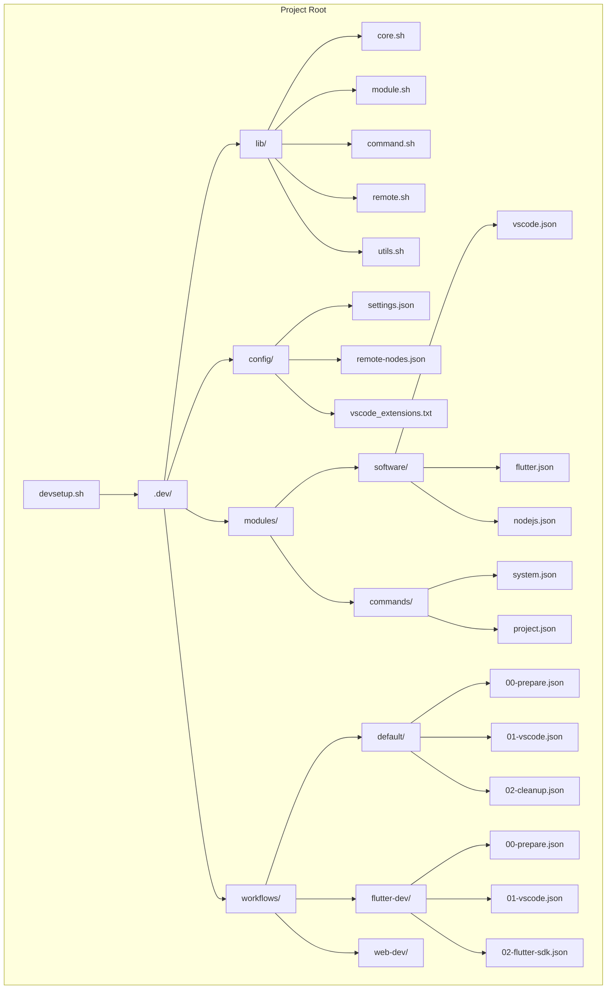
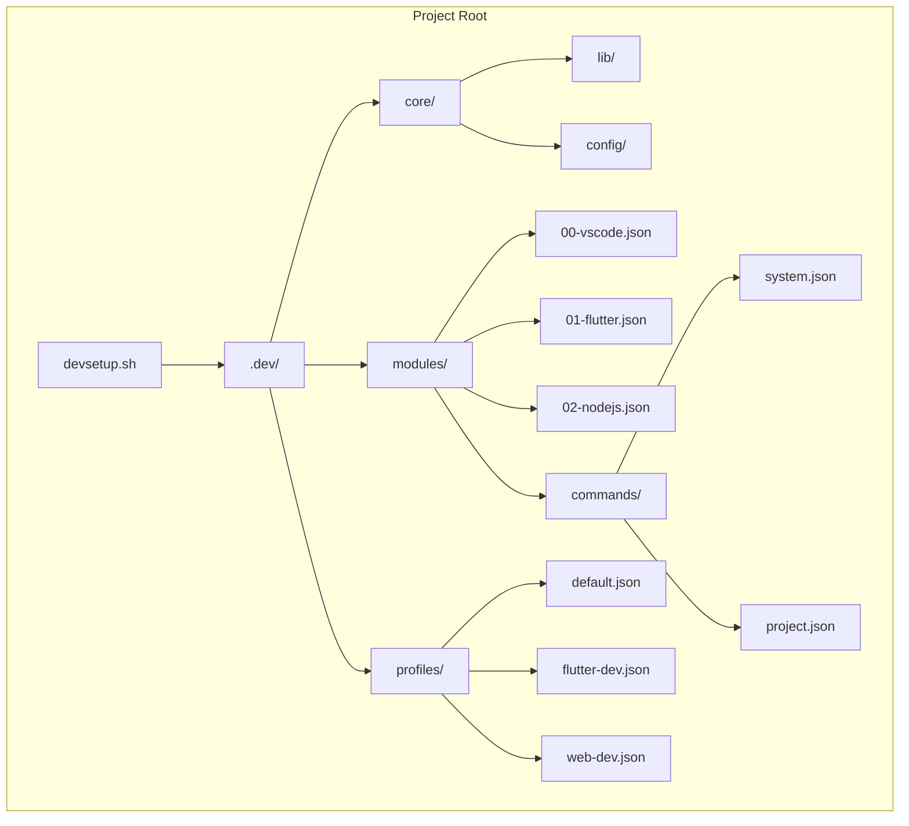

# Revised Directory Structure with .dev/ Approach

Below is a diagram showing how the modular development environment setup system would be organized when dropped into any project root:

## Key Benefits of This Structure

1. **Minimal Project Impact**: Only one visible script file in the project root
2. **Clean Organization**: All configuration and modules hidden in the `.dev/` directory
3. **Portability**: Entire setup can be easily added to any project
4. **Project-Specific Configuration**: Each project can have its own customized setup
5. **Discoverability**: Main script is visible and easily accessible

## How This Enables Project-Specific Configurations

With this structure, each project can have its own development environment setup:

1. **Project-Specific Modules**: Custom software modules specific to the project
2. **Project Commands**: Commands tailored to the project's needs
3. **Custom Workflows**: Workflows designed for specific project roles
4. **Local Settings**: Configuration specific to the project

## Alternative Structure: Using Profiles

This alternative structure uses "profiles" instead of "workflows" and puts numeric prefixes directly on module files for a flatter organization.